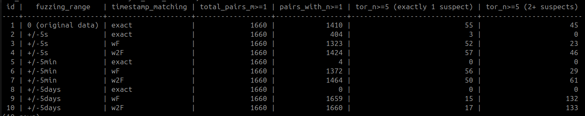
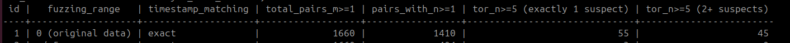
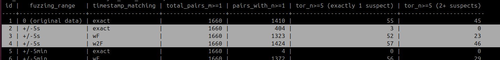

this is an explanation for the table above 

disclaimer: this is based on old data that i have previously matched to try and find bridges
I had two separate tables(not shared here ) in my database from when i crawled the network 
one storing the IPV4 nodes and the other one storing the tor nodes - each together with their peers info

this is what each row means 

- `fuzzing_range`: this is the fuzzing range that i applied to all peers at first i did not apply any fuzzing 
and then i used [+/-5] seconds, [+/-5] minutes, [+/-5] days 
- `timestamp_matching` : this is the correlation window, this is what i was using to find matching timestamp
    - `exact` - means i was checking the exact timestamp match between two peers.
    - `WF`- means i was checking timestamp matches between peers within the fuzzing range like [-/+5] seconds.
    - `W2F` - means i was checking the timestamp matches between peers within 2x of the fuzzing window for example [-/+10] seconds 
- `total_pairs_m>=1` - this is the total number of (ipv4, tor) pairs that had at least one matching peer 
- `pairs_with_n>=1` - this is the total of pairs that have at least one address  one matching timestamp
- `tor_n>=5(exactly 1 suspect)` - this is the total number of tor nodes that had exactly one ipv4 node that they share 5 or more timestamp matches with.
- `tor_n>=5(2+suspects)` - this is the total number of tor nodes that have 2 or more ipv4 nodes that they share  >=5 ( 5 or more peers ) with the exact matching timestamp 
 

I pared the nodes  on shared peers and then shared timestamps, without fuzzing the timestamps
and measured 3 things 
- Pairs sharing >=1 peers,   found 1660 ( tor, ipv4 ) pairs that share at least one address.
- Pairs with >=1 exact-timestamp - of those 1660 , 1410 also have at least one shared peer whose timestamp matches exactly 
- tor_n>=5(exactly 1 suspect)(possible bridges) - 55 tor nodes have exactly one ipv4 node with which they share the >=5( 5 or more peers ) with the exact matching timestamps.
- tor_n>=5(2+suspects)(another set of tor nodes)  - wI have 45 tor nodes that have 2 or more ipv4 nodes which they share >=5 ( 5 or more peers ) with the exact matching timestamp 

Then i introduced fuzzing 

Next  i applied fuzzing to all the peer timestamps in that table based on a given range. Each timestamp is shifted by its own random amount, independently - and independently on the tor and ipv4 sides (the same node serving a different fuzzed value per interface).
so for this row i fuzzed within the range of [+/-5] seconds 

and then i ran the correlation analysis again 

note that pairs sharing >= 1 peers this doesn't change, since this is dependant on peers share and not timestamp sharing so it says the same 1,660 

After fuzzing with a [+/-5] seconds window 
- exact -first i check exact timestamp matches -timestamps that are exactly the same after fuzzing
- +F(wf) - i check timestamps that are withing the fuzzing ranges itself so[+/-5] seconds
- +2f (w2f) - timestamps that are within twice the range so here (+/-10 seconds). this models an attacker who widens the window to undo the fuzz - since two values each shifted by up to +/-F can differ by up to 2F, this is the realistic attacker, not the exact check.

the output for this was 
for exact column ( this is me checking shared timestamp exact shared timestamps even after fuzzing  )
- 1,660 - pairs sharing at least one peer ( this remains unchanged )
- 404 - pairs with at least one share peers whose timestamp are exactly the same
- 3 tor nodes with exactly one ipv4 node sharing >=5 peers whose timestamps are exactly the same 
- 0 tor nodes with 2+ ipv4 nodes sharing >=5 peers whose timestamp are exactly

the next row is me checking (shared timestamps withing this range +/-5 seconds)
- 1,660 - pairs sharing at least one peer ( this remains unchanged )
- 1,323 - pairs with at least one share peers whose timestamp fall withing [+/-5] seconds of each other 
- 52 tor nodes with exactly one ipv4 node sharing >=5 peers whose timestamps are within this +/-5 seconds range  
- 23 tor nodes with 2+ ipv4 nodes sharing >=5 peers whose timestamp are within this +/-5 seconds range 

and them the next row is (shared timestamp within 2f of the fuzzing range)

- 1,660 - pairs sharing at least one peer ( this remains unchanged )
- 1424 - pairs with at least one share peers whose timestamp fall withing [+/-10] seconds of each other 
- 57 tor nodes with exactly one ipv4 node sharing >=5 peers whose timestamps are within this +/-10 seconds range  
- 46 tor nodes with 2+ ipv4 nodes sharing >=5 peers whose timestamp are within this +/-10 seconds range 

i did this for all the other minutes and days 

tldr: 

this is a summary of what i have noticed
the days have the most effect 
the number of tor nodes that have exactly one ipv4 node that share 5 or more peers with matching timestamps reduces
while the number of tor nodes that have 2 or more ipv4 nodes increases, so i can assume the ones that were in tor_n>=5 (exactly 1 suspect)
moved to the tor_n>=5 (2+ suspects) category 

also my assumption is that most peer timestamps are within days of each other 
so when you fuzz +/-5days and then check for timestamps within the same range, 
now nearly every pair has at least one shared peer that also falls within that range 

so +/-days breaks correlation not by hiding the real match but by surrounding it with false positives - the unique bridges become ambiguous. (this defeats an attacker who fixes the window to the fuzz range; a smarter likelihood-based attacker might still pick the true match out, which is the next thing to test.)

if you had 1 then fuzzed by - 5
then another 1 and then fuzzed by - 5 
-5 - 5 = 10 