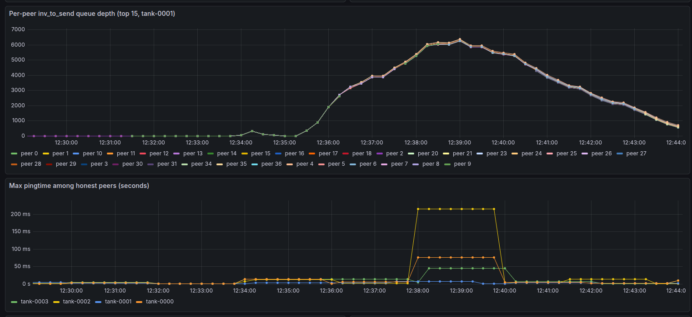
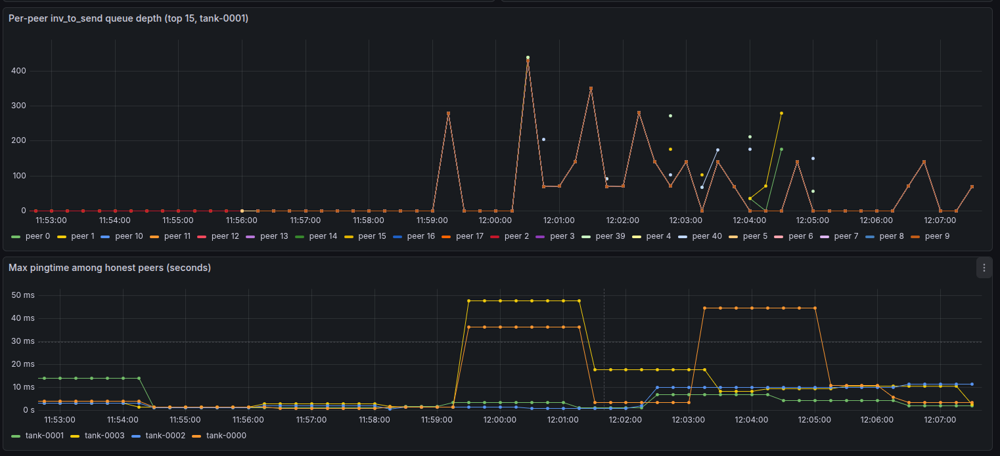
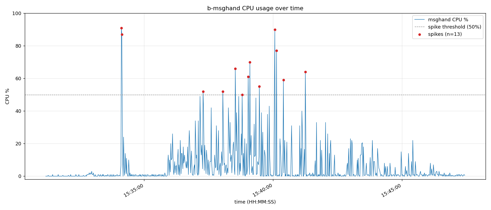
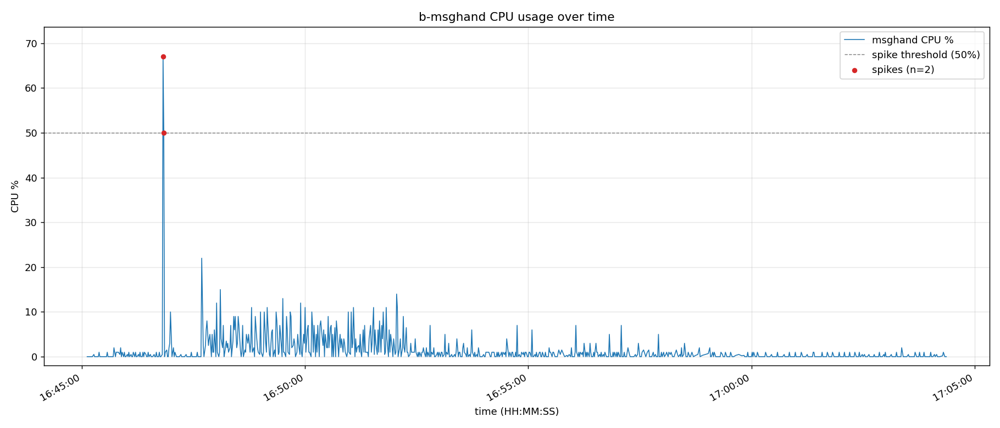

Concept ACK.

Previously, CPU and memory costs could grow significantly as queue size increased.
This is especially  noticeable when we receive a flood of transactions.

I've attempted to test these changes using a Warnet scenario:

Setup:
- 4-node network, `tank-0000` and `tank-0001` are peers.
- 38 additional silent listener peers attached to `tank-0001`
  (they accept INVs but never reply with `getdata`,
 was trying to create a  worst case for the per-peer sort path)
- ~10,000 transactions injected into `tank-0000`, then relayed
  to `tank-0001`
- mempool size and test conditions consistent across both runs

I then compared the behavior before(on master) and after the changes in this PR.

The graphs below show `per-peer inv_to_send queue sizes` and `ping times`(excluding silent peers) for each run,
covering the period from initial connection.
The first graph shows the queue size for each peer.
The second graph shows the ping time for the nodes.

On `master`, per-peer queues climbed to ~6,300 entries and honest-peer
max pingtime crossed 200ms.

With this PR, per-peer queues stayed under ~420 and
honest-peer max pingtime stayed under ~50ms.

measured b-msghand thread CPU on `tank-0001` (same scenario, same network size,
sampled per-second from `/proc/<pid>/task/<tid>/stat`):

On `master`, the thread crossed 50% CPU 13 times,
with peaks near 90%.

With this PR, the same thread crossed 50% only twice.

